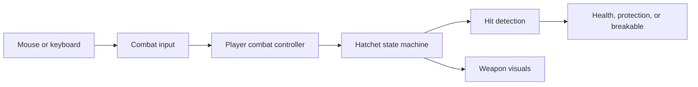

# System's overview

1. **World layout and collision.** `PrototypeLoop` (formerly `Tutorial`) uses the imported 16-by-16-pixel tiles for a linear practice route: pickup, dummies, bushes, cracked stone, Recall, return to the dummies, an enemy arena, a bonfire, a Recall puzzle, and a second fire beyond its door. A sample-map prefab supports tile experiments; `MovementPlayground` preserves the earlier movement test area. `PrototypeLoop` is the scene enabled for builds.

   Visible tiles and physical boundaries are separate. Box colliders match the water surrounding the route, making barriers explicit and editable. Painting another water tile does not automatically add collision.

2. **Input, movement, and facing.** `PlayerMovementInput` converts WASD and arrow keys into a direction through `IMovementInput`. `PlayerMovement` applies that direction to a `Rigidbody2D` during physics updates, letting Unity handle obstacle collisions. Diagonal directions are normalized to keep speed consistent; a friction-free material helps the player slide along walls.

   `PlayerFacing` independently handles the four-direction placeholder marker and retains facing while idle. Movement supports eight directions, while weapon aim follows the mouse. Controls are keyboard and mouse only. Separating input from movement keeps key bindings out of movement rules.

3. **Camera follow and zoom.** `CameraFollow2D` smoothly follows a target after movement updates. It needs only the target's position, so it can follow objects other than the player. `CameraZoom2D` separately handles smooth scroll-wheel zoom, starting at size 5.5 and staying within 3-8. Smaller orthographic sizes show a closer view. Both components live on the reusable camera prefab.

4. **Weapon pickup and controls.** `HatchetPickup` detects overlap and equips the weapon through `PlayerCombatController`. One prefab instance serves as the ground pickup, held weapon, and projectile.

   `PlayerCombatInput` supplies actions through `ICombatInput`. The controller converts the cursor into a world-space aim direction, briefly remembers combo clicks, and commands `HatchetWeapon`. Left click chains three chops; holding and releasing right click performs a charged spin; E throws or recalls. Focus loss and pausing cancel charging.

5. **Weapon actions and hit detection.** `HatchetWeapon` uses a state machine: ground, held, chop, charge, cleave, flying, stuck, and returning states determine which actions are allowed. This prevents overlapping actions and disables melee while the weapon is away.

   Light attacks have a brief wind-up, a fast slash, and a short recovery. Only the slash phase can deal damage. `HatchetHitDetector` handles physics separately. Melee checks reach, angle, and terrain obstruction. Flight checks the full distance traveled each physics step to catch obstacles between positions. Each target takes at most one hit per swing or flight leg. Outward throws stop on impact or at maximum range; returning throws can hit multiple targets.

6. **Health, protection, and reactions.** `CombatHit` carries damage, direction, impact position, knockback, stagger, and guard-breaking information to an `IHitReceiver`. `Damageable` manages health; `ShieldProtection` supplies protection through `IHitProtection`; `HitReaction` responds to accepted hits with knockback and stagger timing.

   `Breakable` handles destructible props. Bushes accept ordinary hits, while shields and cracked stones require a full cleave to break. Separate target components let the same weapon interact with different objects without owning their internal rules.

   Returning hatchets can also bypass an intact shield by hitting the target's rear half. The shield compares the actual impact position with its facing direction, shown by the dummy's blue arrow. Front and exact-side Recall hits remain guarded. Rear hits deal ordinary Recall damage without breaking the shield; a special knockdown/stun is planned for later.

7. **Recall progression.** Picking up the hatchet leaves Recall locked. Players initially retrieve stopped throws on foot. The eastern altar's `RecallUnlockPickup` calls `PlayerCombatController.UnlockRecall()`; a future puzzle can call the same method.

   Once unlocked, E recalls the weapon toward the moving player, ignoring terrain so it can reach its owner. The same return starts automatically if an outbound or planted hatchet gets more than 10 units away from the player. This threshold exceeds the 6-unit throw range and the marked puzzle repositioning distance; it is adjustable in `HatchetSettings.asset`. Automatic Recall uses the normal return damage and costs no extra stamina. Repeated unlock calls are harmless. Bonfire saves preserve equipment and Recall; loading restores them through the same player methods used during normal play.

8. **Feedback, practice targets, and tuning.** `HatchetView` reads weapon state to draw tapered slashes, charge indicators, spins, and trails independently of damage calculations. Slash effects share the weapon's timing and follow its swing direction. `HatchetComboIndicator` shows the current combo hit with three small pips above the player. `TutorialCombatHUD` now displays prototype instructions, player health and stamina, charge progress, controls, and a defeat/restart prompt. `PracticeTarget` adds health labels, hit flashes, and a four-second reset after defeat, restoring health, position, and shields. Practice dummies remain separate from the actual enemy.

   Prefabs store reusable object setups. `HatchetSettings.asset` is a ScriptableObject: an asset holding attack timing, damage, stamina costs, range, and flight speeds separately from behavior. Combat can therefore be tuned in the Inspector without changing code.

9. **Player health and defeat.** The player reuses `Damageable` with 100 health and `HitReaction` for knockback. `PlayerHealth` implements `IHitProtection` to reject damage for 0.8 seconds after a hit, and consults `PlayerDash` for the brief dodge window. Movement lets knockback run during stagger. Defeat stops player controls and cancels active hatchet damage. R or the defeat button reloads the scene at the last bonfire with full health/stamina and permanent progress intact. Before the first fire, defeat restarts the original route.

10. **Simple enemy.** `SimpleMeleeEnemy` notices the player, approaches, locks its attack direction, winds up for 0.65 seconds, strikes for 20 damage, then recovers for 0.9 seconds. Range, angle, and line-of-sight checks prevent hits outside the attack or through walls. Weapon stagger interrupts attacks, and the enemy returns home if the player leaves its area. `MeleeEnemyView` separately draws the warning arc, colors, and status label. Its reusable `MeleeSentinel` prefab has 100 health and resets when resting, travelling, or respawning.

11. **Prototype teaching route.** `PrototypeLoopGuide` listens for actual dummy hits and checks pickup, retrieval, broken props, Recall, enemy defeat, bonfire discovery, and puzzle completion. It supplies one current instruction and opens route gates as lessons are completed. The first fire follows the enemy arena; the second sits beyond the puzzle door. Saved milestones keep completed lessons open when enemies reset. This sequence belongs to the prototype scene rather than the weapon or enemy systems.

12. **Bonfires and travel.** Approach a fire and press **F** to light/rest at it: restore health and stamina fully, retrieve the hatchet, clear stagger, reset enemies/dummies, save, and set the respawn location. `PlayerBonfireInteraction` handles the nearby interaction and locks movement/attacks while the menu is open; F or Escape leaves it. After discovering both fires, their menus offer travel between them. `Bonfire` holds each fire's stable ID and safe spawn point, while `BonfireView` draws its placeholder flame and label. Hatchet upgrades will join this menu when Sun Shards are implemented.

13. **Throw/Recall puzzle.** Stand on the gold floor mark and throw at the gold target to arm the mechanism. Move to the blue floor mark and recall through the blue target to open the door. `HatchetPuzzleTarget` receives the existing `CombatHit` data through `IHitReceiver`; `ThrowRecallPuzzle` enforces the throw-then-return sequence and tells `PuzzleDoor` to open. Melee, an outbound hit on the blue target, or Recall before arming cannot solve it. Rest resets an unfinished attempt, while a completed door remains open.

14. **Checkpoint saves and world resets.** `CheckpointSession` keeps progress across scene reloads. `IProgressParticipant` lets the guide, puzzle, altar, and cleared route obstacles capture/restore their own state; `IResetOnRest` lets ordinary enemies and dummies reset independently. `PlayerPrefsProgressStore` stores a small versioned JSON record locally, behind `IProgressStore`. Saves contain equipment, Recall, checkpoint/fire IDs, cleared obstacles, route milestones, and completed puzzles. Puzzle completion saves immediately without changing the checkpoint; death preserves earned progress once a checkpoint exists. A fresh launch resumes the saved fire. **New run...** in a fire menu asks before clearing this prototype's save.

15. **Sprint and stamina.** Hold **either Shift key** while moving to sprint at 7.2 units/second instead of 4.5. `PlayerMovementInput` supplies sprint intent through `IMovementInput`; `PlayerMovement` applies speed and spends stamina only while sprinting. Melee and charging allow walking but stop sprinting. At exhaustion, movement returns to walking and needs 20 stamina to start sprinting again. Stagger, focus loss, disabled controls, fire menus, and death stop sprinting. The Back to Dummies trail sign introduces Shift sprint on the return walk.

    `PlayerStamina` owns a 100-point pool and recovers 25 points/second after 0.8 seconds without spending or performing melee. `HatchetWeapon` asks the small `IStamina` interface to pay before changing action state. Failed or overlapping actions do not spend stamina or advance the combo. Cleaves pay once when charging begins, including cancelled charges; holding a charge cannot recover that cost. Throwing pays for the round trip, so Recall and on-foot retrieval remain free. Rest, travel, and respawn restore stamina; it is not permanent save data. The HUD shows the pool, turns amber below 25%, and flashes red when an action is unaffordable.

    Initial combat values are a tuning baseline, not a finished balance:

    | Action | Damage | Stamina cost |
    | --- | --- | --- |
    | Light combo | 10 / 10 / 15 | 18 / 18 / 24 |
    | Full charged cleave | 30 | 35 |
    | Throw | 15 | 25 |
    | Recall return | 10 | Free; included in throw |
    | Sprint | None | 20 per second |
    | Short dash / dodge | None | 25 |

    Player, sentinel, and practice dummies have 100 HP; the sentinel hits for 20. One full combo costs 60 stamina and deals 35 damage. Continuous slashing exhausts the player before killing the sentinel, creating a reason to disengage and recover.

16. **Short dash / dodge.** Tap **Space** to dash 2.2 units over 0.18 seconds, spending 25 stamina. Direction locks to current movement, or the last facing direction while standing still; diagonals travel the same distance. Only the opening 0.1 seconds blocks damage, followed by an exposed ending and a 0.35-second cooldown after the dash. The sentinel arena sign and HUD teach the control.

    `PlayerDash` owns timing, direction, and cost. `PlayerMovement` remains the only component that applies player movement velocity, so sprint, dash, knockback, and wall collision cannot fight over the Rigidbody. Input remembers a short Space tap until the next physics step and consumes it once; holding Space does not repeat dashes. Attacks and dashes cannot start over one another, but Recall remains available while dodging. Stagger, disabled controls, focus loss, and defeat cancel the dash. Rest and travel reset its cooldown and refill stamina; respawning creates a fresh dash state.

17. **Sun Shards and hatchet upgrades.** PrototypeLoop contains three one-time rewards: a pickup dropped when the sentinel falls, an immediate award for solving the throw/Recall puzzle, and a pickup on the optional north trail beyond the puzzle door. Walk over gold shards to collect them. The HUD shows unspent shards. At the second bonfire, press **F**, open **Hatchet upgrades**, review three choices, then confirm one for **3 Sun Shards**. The other two choices disappear for that run.

    | First-tier choice | Effect | Unchanged |
    | --- | --- | --- |
    | Quick Hands | 20% faster light slashes and recovery; first two swings take about 0.167 seconds | Damage, stamina per swing, reach |
    | Sweeping Edge | Light slash arc grows from 110 to 150 degrees | Forward reach, damage, timing, stamina |
    | Wide Cleave | Charged cleave radius grows from 2.1 to 2.6 units | Damage, charge time, stamina |

    These values are a starting point for balance testing. `SunShardReward` listens to enemy defeat or puzzle completion, independently of their combat logic. A reusable prefab supplies the pickup trigger and gold placeholder. Stable reward IDs record both availability and collection; an uncollected sentinel drop survives a reload, and killing a revived sentinel never produces another reward. Collected shards, spending, and upgrades survive rest, death, travel, and game reload. Rewards save even before the first bonfire; a death there returns the player to the start while keeping saved progress. New run clears progression.

    `HatchetUpgrade` assets describe each choice; `HatchetUpgradeTier` groups choices and sets the price. `WeaponUpgradeProgression` owns sequential tier selection, affordability, and permanent exclusions without depending on menus or storage. `CheckpointSession` validates the open bonfire and player before saving the purchase. `BonfireUpgradeMenu` only presents the options. The weapon rebuilds its effective stats from saved selections, and its visuals use those same stats. Shared base settings are never modified, so reloading cannot accidentally stack a bonus twice or change other weapons.

    Add future tiers by creating choice/tier assets and appending them to the session's ordered **Upgrade Tiers** array. Existing stat effects combine across tiers. New behaviors such as curved flight will require their own focused implementation; the purchase and persistence flow can stay the same. Old version-one saves load with zero shards and no upgrades; already solved puzzles grant their reward on restoration, and the sentinel can be defeated again to earn its new reward.

The design follows SOLID principles through focused responsibilities, small interfaces, and events. Interfaces define what a component provides or accepts. Events let health notify reaction and feedback components when damage occurs. For example, adding another object that implements `IHitReceiver` does not require changing player controls.

Common settings are located here, relative to `TheLostShrine/`:

| Setting | Location |
| --- | --- |
| Walking/sprint speeds and sprint cost | `PlayerMovement` on `Assets/Prefabs/Player/Player.prefab` |
| Stamina maximum, regeneration, and delay | `PlayerStamina` on `Assets/Prefabs/Player/Player.prefab` |
| Dash distance, duration, cost, cooldown, and dodge window | `PlayerDash` on `Assets/Prefabs/Player/Player.prefab` |
| Camera smoothing and zoom limits | `Assets/Prefabs/Cameras/FollowCamera.prefab` |
| Attack costs, timing, damage, reach, flight speed, and automatic Recall distance | `Assets/Settings/Weapons/HatchetSettings.asset` |
| Weapon appearance | `Model` child of `Assets/Prefabs/Weapons/Hatchet.prefab` |
| Upgrade descriptions, effects, and first-tier cost | `Assets/Settings/Weapons/Upgrades/` |
| Tier order | **Upgrade Tiers** on `Checkpoint Session` |
| Shard IDs and reward sources | `Sun Shards and Upgrades` in PrototypeLoop; `Assets/Prefabs/World/SunShard.prefab` |
| Terrain and barriers | PrototypeLoop's Tilemaps and `World/Boundaries` |
| Dummy health | `Damageable` on prefabs in `Assets/Prefabs/Combat/` |
| Player health and damage immunity | `Damageable` and `PlayerHealth` on `Assets/Prefabs/Player/Player.prefab` |
| Enemy health, detection, and attack timing | `Assets/Prefabs/Combat/MeleeSentinel.prefab` |
| Teaching sequence and gates | `Prototype Loop HUD` and `Prototype Route` in the scene |
| Fire appearance and interaction radius | `Assets/Prefabs/World/Bonfire.prefab` |
| Fire IDs and respawn positions | Each Bonfire instance under `Bonfires and Recall Puzzle` |
| Puzzle targets, floor marks, and door | `Assets/Prefabs/World/ThrowRecallPuzzle.prefab` |
| Local save slot | `Checkpoint Session` in the scene; default key `TheLostShrine.PrototypeLoop.Save.v1` |

Verification scripts live in `Tools/Verification/` and run through Unity MCP in Play Mode. Always use an empty `TheLostShrine.Verification.*` checkpoint save key and restore the normal scene key afterward. `StaminaPlayModeChecks.cs.txt` exercises real keyboard bindings, exhaustion, spending, recovery, cancellation, free Recall, rest/travel, and death. The older hatchet and route checks refill stamina between simulated actions to isolate their geometry/progression assertions. The bonfire/puzzle checks run with the normal stamina rules. `AutoRecallPlayModeChecks.cs.txt` covers the unlock, distance boundary, in-flight recall, free retrieval, return damage, and manual retrieval. `DashPlayModeChecks.cs.txt` covers Space input, distance, wall collision, dodge protection, action exclusivity, stamina, interruption, and rest/death. The browser build has not been rebuilt for these changes.

`SunShardPlayModeChecks.cs.txt` checks unique rewards, the actual throw/Recall puzzle reward, safe detour access, purchase validation, permanent choices, all three effects against actual combat targets, future-tier composition, and old-save compatibility. `SetupSunShardPrototype.cs.txt` records the Edit Mode asset/scene setup; it is not a runtime dependency.

Latest verification: 39 shard/upgrade, 39 dash, 20 automatic Recall, 50 stamina, 78 hatchet, 46 route/health/enemy, and 38 bonfire/puzzle assertions passed (310 total). Purchased upgrades and collected shards were also verified across death/respawn and a fresh Play Mode load.
