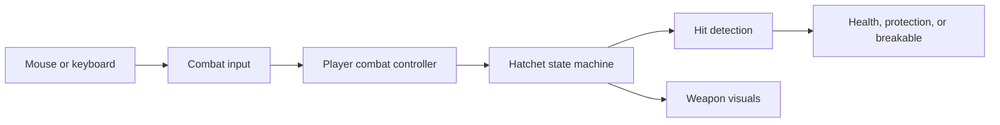

# System's overview

1. **World layout and collision.** Tutorial is painted with 64 imported 16-by-16-pixel tiles using Unity's Tilemap and Tile Palette tools. A sample-map prefab supports tile experiments; `MovementPlayground` preserves the earlier movement test area. Tutorial is the scene enabled for builds.

   Visible tiles and physical boundaries are separate. Box colliders block the pond and island edges, making barriers explicit and editable. Painting another water tile does not automatically add collision.

2. **Input, movement, and facing.** `PlayerMovementInput` converts WASD and arrow keys into a direction through `IMovementInput`. `PlayerMovement` applies that direction to a `Rigidbody2D` during physics updates, letting Unity handle obstacle collisions. Diagonal directions are normalized to keep speed consistent; a friction-free material helps the player slide along walls.

   `PlayerFacing` independently handles the four-direction placeholder marker and retains facing while idle. Movement supports eight directions, while weapon aim follows the mouse. Controls are keyboard and mouse only. Separating input from movement keeps key bindings out of movement rules.

3. **Camera follow and zoom.** `CameraFollow2D` smoothly follows a target after movement updates. It needs only the target's position, so it can follow objects other than the player. `CameraZoom2D` separately handles smooth scroll-wheel zoom, starting at size 5.5 and staying within 3-8. Smaller orthographic sizes show a closer view. Both components live on the reusable camera prefab.

4. **Weapon pickup and controls.** `HatchetPickup` detects overlap and equips the weapon through `PlayerCombatController`. One prefab instance serves as the ground pickup, held weapon, and projectile.

   `PlayerCombatInput` supplies actions through `ICombatInput`. The controller converts the cursor into a world-space aim direction, briefly remembers combo clicks, and commands `HatchetWeapon`. Left click chains three chops; holding and releasing right click performs a charged spin; E throws or recalls. Focus loss and pausing cancel charging.

5. **Weapon actions and hit detection.** `HatchetWeapon` uses a state machine: ground, held, chop, charge, cleave, flying, stuck, and returning states determine which actions are allowed. This prevents overlapping actions and disables melee while the weapon is away.

   Light attacks have a brief wind-up, a fast slash, and a short recovery. Only the slash phase can deal damage. `HatchetHitDetector` handles physics separately. Melee checks reach, angle, and terrain obstruction. Flight checks the full distance traveled each physics step to catch obstacles between positions. Each target takes at most one hit per swing or flight leg. Outward throws stop on impact or at maximum range; returning throws can hit multiple targets.

6. **Health, protection, and reactions.** `CombatHit` carries damage, direction, impact position, knockback, stagger, and guard-breaking information to an `IHitReceiver`. `Damageable` manages health; `ShieldProtection` supplies protection through `IHitProtection`; `HitReaction` responds to accepted hits with knockback and stagger timing.

   `Breakable` handles destructible props. Bushes accept ordinary hits, while shields and cracked stones require a full cleave to break. Separate target components let the same weapon interact with different objects without owning their internal rules.

   Returning hatchets can also bypass an intact shield by hitting the target's rear half. The shield compares the actual impact position with its facing direction, shown by the dummy's blue arrow. Front and exact-side Recall hits remain guarded. Rear hits deal ordinary Recall damage without breaking the shield; a special knockdown/stun is planned for later.

7. **Recall progression.** Picking up the hatchet leaves Recall locked. Players initially retrieve stopped throws on foot. The northern altar's `RecallUnlockPickup` calls `PlayerCombatController.UnlockRecall()`; a future puzzle can call the same method.

   Once unlocked, E recalls the weapon toward the moving player, ignoring terrain so it can reach its owner. Repeated unlock calls are harmless. Progress lasts for the play session; persistent saves are not implemented.

8. **Feedback, practice targets, and tuning.** `HatchetView` reads weapon state to draw tapered slashes, charge indicators, spins, and trails independently of damage calculations. Slash effects share the weapon's timing and follow its swing direction. `HatchetComboIndicator` shows the current combo hit with three small pips above the player. `TutorialCombatHUD` displays controls, charge progress, and Recall status. `PracticeTarget` adds health labels, hit flashes, and a four-second reset after defeat, restoring health, position, and shields. These are training targets; enemy AI is not implemented.

   Prefabs store reusable object setups. `HatchetSettings.asset` is a ScriptableObject: an asset holding attack timing, damage, range, and flight speeds separately from behavior. Combat can therefore be tuned in the Inspector without changing code.

The design follows SOLID principles through focused responsibilities, small interfaces, and events. Interfaces define what a component provides or accepts. Events let health notify reaction and feedback components when damage occurs. For example, adding another object that implements `IHitReceiver` does not require changing player controls.

Common settings are located here, relative to `TheLostShrine/`:

| Setting | Location |
| --- | --- |
| Player speed | `PlayerMovement` on `Assets/Prefabs/Player/Player.prefab` |
| Camera smoothing and zoom limits | `Assets/Prefabs/Cameras/FollowCamera.prefab` |
| Combat timing, damage, reach, and flight speed | `Assets/Settings/Weapons/HatchetSettings.asset` |
| Weapon appearance | `Model` child of `Assets/Prefabs/Weapons/Hatchet.prefab` |
| Terrain and barriers | Tutorial's Tilemaps and `World/Boundaries` |
| Dummy health | `Damageable` on prefabs in `Assets/Prefabs/Combat/` |

Verification covers pickup, attack rules, damage, retrieval, Recall, and mouse/keyboard input. The optional [HatchetPlayModeChecks.cs.txt](../Tools/Verification/HatchetPlayModeChecks.cs.txt) preserves combat checks for execution through Unity MCP; it is not compiled into the game. See [HatchetPrototype.md](HatchetPrototype.md) for detailed behavior and verification instructions.
