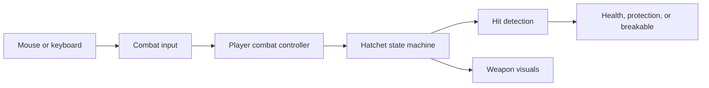

# System's overview

1. **World layout and collision.** `PrototypeLoop` (formerly `Tutorial`) uses the imported 16-by-16-pixel tiles for a linear practice route: pickup, dummies, bushes, cracked stone, Recall, return to the dummies, an enemy arena, a bonfire, a Recall puzzle, and a second fire beyond its door. A sample-map prefab supports tile experiments; `MovementPlayground` preserves the earlier movement test area. `PrototypeLoop` is the scene enabled for builds.

   Visible tiles and physical boundaries are separate. Box colliders match the water surrounding the route, making barriers explicit and editable. Painting another water tile does not automatically add collision.

2. **Input, movement, and facing.** `PlayerMovementInput` converts WASD and arrow keys into a direction through `IMovementInput`. `PlayerMovement` applies that direction to a `Rigidbody2D` during physics updates, letting Unity handle obstacle collisions. Diagonal directions are normalized to keep speed consistent; a friction-free material helps the player slide along walls.

   `PlayerFacing` independently handles the four-direction placeholder marker and retains facing while idle. Movement supports eight directions, while weapon aim follows the mouse. Controls are keyboard and mouse only. Separating input from movement keeps key bindings out of movement rules.

3. **Camera follow and zoom.** `CameraFollow2D` smoothly follows a target after movement updates. It needs only the target's position, so it can follow objects other than the player. `CameraZoom2D` separately handles smooth scroll-wheel zoom, starting at size 5.5 and staying within 3-8. Smaller orthographic sizes show a closer view. Both components live on the reusable camera prefab.

4. **Weapon pickup and controls.** `HatchetPickup` detects overlap and equips the weapon through `PlayerCombatController`. One prefab instance serves as the ground pickup, held weapon, and projectile.

   `PlayerCombatInput` supplies actions through `ICombatInput`. The controller converts the cursor into a world-space aim direction, briefly remembers combo clicks, and commands `HatchetWeapon`. Left click chains three chops; holding and releasing right click performs a charged spin; E throws or recalls. Focus loss and pausing cancel charging.

5. **Weapon actions and hit detection.** `HatchetWeapon` uses a state machine: ground, held, chop, charge, cleave, flying, stuck, and returning states determine which actions are allowed. This prevents overlapping actions and disables melee while the weapon is away.

   Light attacks have a brief wind-up, a fast slash, and a short recovery. Only the slash phase can deal damage. `HatchetHitDetector` handles physics separately. Melee checks reach, angle, and terrain obstruction. Flight checks the full distance traveled each physics step to catch obstacles between positions. Each target takes at most one hit per swing or flight leg. Outward throws stop on impact or at maximum range; returning throws can hit multiple targets.

6. **Health, protection, and reactions.** `CombatHit` carries damage, direction, impact position, knockback, stagger, and guard-breaking information to an `IHitReceiver`. `Damageable` manages health; `ShieldProtection` supplies protection through `IHitProtection`; `HitReaction` responds to accepted hits with knockback and stagger timing.

   `Breakable` handles destructible props. Bushes accept ordinary hits, while shields and cracked stones require a full cleave to break. Separate target components let the same weapon interact with different objects without owning their internal rules.

   Returning hatchets can also bypass an intact shield by hitting the target's rear half. The shield compares the actual impact position with its facing direction, shown by the dummy's blue arrow. Front and exact-side Recall hits remain guarded. Rear hits deal ordinary Recall damage without breaking the shield; a special knockdown/stun is planned for later.

7. **Recall progression.** Picking up the hatchet leaves Recall locked. Players initially retrieve stopped throws on foot. The eastern altar's `RecallUnlockPickup` calls `PlayerCombatController.UnlockRecall()`; a future puzzle can call the same method.

   Once unlocked, E recalls the weapon toward the moving player, ignoring terrain so it can reach its owner. Repeated unlock calls are harmless. Bonfire saves preserve equipment and Recall; loading restores them through the same player methods used during normal play.

8. **Feedback, practice targets, and tuning.** `HatchetView` reads weapon state to draw tapered slashes, charge indicators, spins, and trails independently of damage calculations. Slash effects share the weapon's timing and follow its swing direction. `HatchetComboIndicator` shows the current combo hit with three small pips above the player. `TutorialCombatHUD` now displays prototype instructions, player health, charge progress, controls, and a defeat/restart prompt. `PracticeTarget` adds health labels, hit flashes, and a four-second reset after defeat, restoring health, position, and shields. Practice dummies remain separate from the actual enemy.

   Prefabs store reusable object setups. `HatchetSettings.asset` is a ScriptableObject: an asset holding attack timing, damage, range, and flight speeds separately from behavior. Combat can therefore be tuned in the Inspector without changing code.

9. **Player health and defeat.** The player reuses `Damageable` with five health and `HitReaction` for knockback. `PlayerHealth` implements `IHitProtection` to reject damage for 0.8 seconds after a hit. Movement lets knockback run during stagger. Defeat stops player controls and cancels active hatchet damage. R or the defeat button reloads the scene at the last bonfire with full health and permanent progress intact. Before the first fire, defeat restarts the original route.

10. **Simple enemy.** `SimpleMeleeEnemy` notices the player, approaches, locks its attack direction, winds up for 0.65 seconds, strikes, then recovers for 0.9 seconds. Range, angle, and line-of-sight checks prevent hits outside the attack or through walls. Weapon stagger interrupts attacks, and the enemy returns home if the player leaves its area. `MeleeEnemyView` separately draws the warning arc, colors, and status label. Its reusable `MeleeSentinel` prefab has six health and resets when resting, travelling, or respawning.

11. **Prototype teaching route.** `PrototypeLoopGuide` listens for actual dummy hits and checks pickup, retrieval, broken props, Recall, enemy defeat, bonfire discovery, and puzzle completion. It supplies one current instruction and opens route gates as lessons are completed. The first fire follows the enemy arena; the second sits beyond the puzzle door. Saved milestones keep completed lessons open when enemies reset. This sequence belongs to the prototype scene rather than the weapon or enemy systems.

12. **Bonfires and travel.** Approach a fire and press **F** to light/rest at it: heal fully, retrieve the hatchet, clear stagger, reset enemies/dummies, save, and set the respawn location. `PlayerBonfireInteraction` handles the nearby interaction and locks movement/attacks while the menu is open; F or Escape leaves it. After discovering both fires, their menus offer travel between them. `Bonfire` holds each fire's stable ID and safe spawn point, while `BonfireView` draws its placeholder flame and label. Hatchet upgrades will join this menu when Sun Shards are implemented.

13. **Throw/Recall puzzle.** Stand on the gold floor mark and throw at the gold target to arm the mechanism. Move to the blue floor mark and recall through the blue target to open the door. `HatchetPuzzleTarget` receives the existing `CombatHit` data through `IHitReceiver`; `ThrowRecallPuzzle` enforces the throw-then-return sequence and tells `PuzzleDoor` to open. Melee, an outbound hit on the blue target, or Recall before arming cannot solve it. Rest resets an unfinished attempt, while a completed door remains open.

14. **Checkpoint saves and world resets.** `CheckpointSession` keeps progress across scene reloads. `IProgressParticipant` lets the guide, puzzle, altar, and cleared route obstacles capture/restore their own state; `IResetOnRest` lets ordinary enemies and dummies reset independently. `PlayerPrefsProgressStore` stores a small versioned JSON record locally, behind `IProgressStore`. Saves contain equipment, Recall, checkpoint/fire IDs, cleared obstacles, route milestones, and completed puzzles. Puzzle completion saves immediately without changing the checkpoint; death preserves earned progress once a checkpoint exists. A fresh launch resumes the saved fire. **New run...** in a fire menu asks before clearing this prototype's save.

The design follows SOLID principles through focused responsibilities, small interfaces, and events. Interfaces define what a component provides or accepts. Events let health notify reaction and feedback components when damage occurs. For example, adding another object that implements `IHitReceiver` does not require changing player controls.

Common settings are located here, relative to `TheLostShrine/`:

| Setting | Location |
| --- | --- |
| Player speed | `PlayerMovement` on `Assets/Prefabs/Player/Player.prefab` |
| Camera smoothing and zoom limits | `Assets/Prefabs/Cameras/FollowCamera.prefab` |
| Combat timing, damage, reach, and flight speed | `Assets/Settings/Weapons/HatchetSettings.asset` |
| Weapon appearance | `Model` child of `Assets/Prefabs/Weapons/Hatchet.prefab` |
| Terrain and barriers | PrototypeLoop's Tilemaps and `World/Boundaries` |
| Dummy health | `Damageable` on prefabs in `Assets/Prefabs/Combat/` |
| Player health and damage immunity | `Damageable` and `PlayerHealth` on `Assets/Prefabs/Player/Player.prefab` |
| Enemy health, detection, and attack timing | `Assets/Prefabs/Combat/MeleeSentinel.prefab` |
| Teaching sequence and gates | `Prototype Loop HUD` and `Prototype Route` in the scene |
| Fire appearance and interaction radius | `Assets/Prefabs/World/Bonfire.prefab` |
| Fire IDs and respawn positions | Each Bonfire instance under `Bonfires and Recall Puzzle` |
| Puzzle targets, floor marks, and door | `Assets/Prefabs/World/ThrowRecallPuzzle.prefab` |
| Local save slot | `Checkpoint Session` in the scene; default key `TheLostShrine.PrototypeLoop.Save.v1` |

Verification includes 78 hatchet checks, 46 route/health/enemy checks, and 38 bonfire/puzzle checks. The optional [HatchetPlayModeChecks.cs.txt](../Tools/Verification/HatchetPlayModeChecks.cs.txt), [PrototypeLoopPlayModeChecks.cs.txt](../Tools/Verification/PrototypeLoopPlayModeChecks.cs.txt), and [BonfirePuzzlePlayModeChecks.cs.txt](../Tools/Verification/BonfirePuzzlePlayModeChecks.cs.txt) are method bodies for Unity MCP, not compiled game scripts. Run them in fresh sessions with an empty, isolated `CheckpointSession` save key; the bonfire suite requires a key starting with `TheLostShrine.Verification.` so it cannot overwrite the normal save. Death/respawn, a fresh Play Mode load from saved data, F/Escape input, New run, and door/corridor reachability were also verified in the Editor. The browser build has not been rebuilt or tested for these changes.
