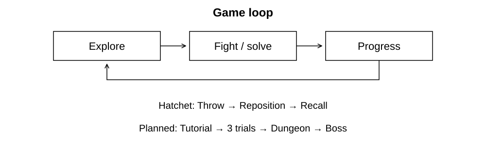

# 
THE LOST SHRINE

# 
[PLAY HERE](https://ronno7.github.io/TheLostShrine/)

## 
[Changelog](CHANGELOG.md)

<a href="Docs/VerticalSlice.md">Development plan</a> · <a href="Docs/SystemsOverview.md">Systems overview</a> · <a href="Docs/Art/README.md">Art guide</a>

  

